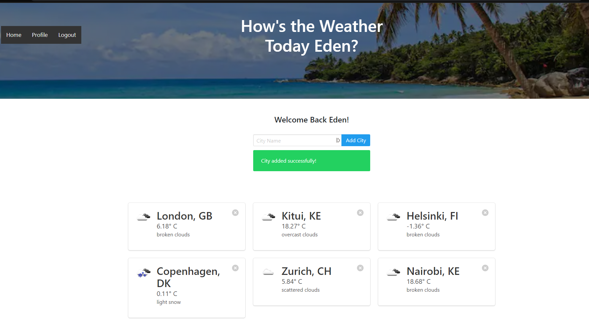

# Flask weatherApp
 A simple web weather app built using flask that displays the current weather of cities across the world. The application allows users to enter a city and returns the current weather conditions of the entered city.

 The application is built with Python, Flask, SQLAlchemy, SQLite and HTML/CSS/Bootstrap 5.

 # Screenshots
 ### Signup page
 

 ### Login page
 

 ### Dashboard
 
